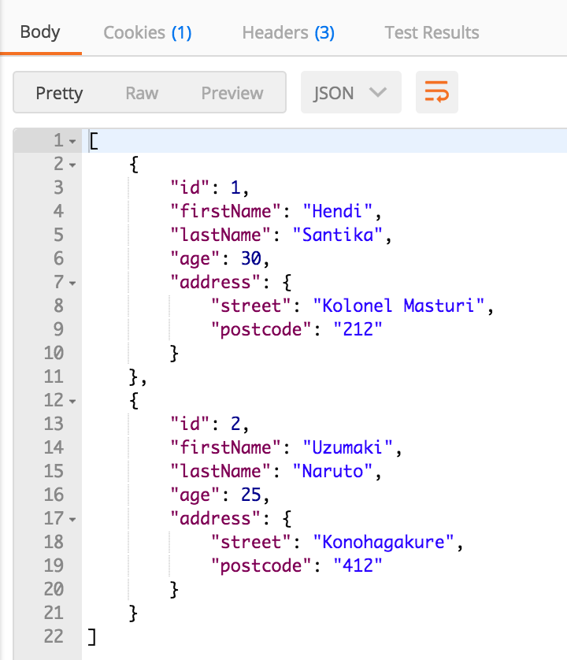
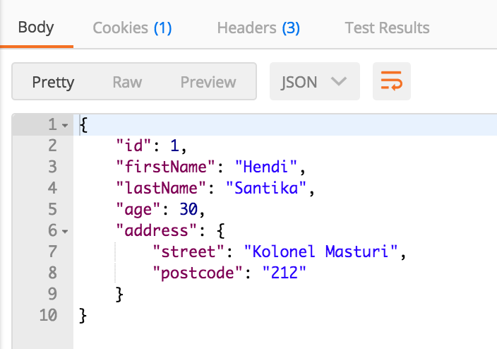

# Kotlin Spring Webflux

### Example using Kotlin Spring Webflux

run this repo.

Copy this to your terminal :

`mvn clean spring-boot:run`

– Make a GET all customer request: `http://localhost:8080/api/customer`

  `curl http://localhost:8080/api/customer`

  

– Make a GET customer request: `http://localhost:8080/api/customer/1`

  `curl http://localhost:8080/api/customer/1`

  

– Make a POST request: `http://localhost:8080/api/customer/post`

 

– Make a PUT request: http://localhost:8080/api/customer/put/3

  

– Make a DELETE request: http://localhost:8080/api/customer/delete/1

– Make a GET all customers request again: http://localhost:8080/api/customer
 
